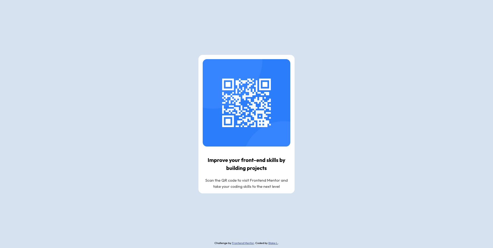

# Frontend Mentor - QR code component solution

This is a solution to the [QR code component challenge on Frontend Mentor](https://www.frontendmentor.io/challenges/qr-code-component-iux_sIO_H). Frontend Mentor challenges help you improve your coding skills by building realistic projects. 

## Table of contents

- [Overview](#overview)
  - [Screenshot](#screenshot)
  - [Links](#links)
- [My process](#my-process)
  - [Built with](#built-with)
  - [What I learned](#what-i-learned)
  - [Continued development](#continued-development)
  - [Useful resources](#useful-resources)
- [Author](#author)

**Note: Delete this note and update the table of contents based on what sections you keep.**

## Overview

TODO

### Screenshot

### Links

- Solution URL: [Add solution URL here](https://github.com/blilla00/qr-code-component)
- Live Site URL: [Add live site URL here](https://blilla00.github.io/qr-code-component/)

## My process

### Built with

- Semantic HTML5 markup
- CSS custom properties
- Flexbox
- Mobile-first workflow

### What I learned

- Using Semantic HTML tags to make pages more accessible
- Never set width: 100vw as this can cause horizontal scroll
- Instead of explicitly setting component height and width, use max-width property with rem units
- Applied Andy Bell's Modern CSS Reset
- Border radius values are better supplied in rem rather than percentages
- Using percentages are typically bad practice and should be avoided when possible. 

### Continued development

- Need to further my layout skills and associated layout technologies (normal flow, flex, grid)
- Need more experience manipulating images
- Typography skills
- Responsive layouts

## Author

- Github - [Blake L](https://github.com/blilla00)

